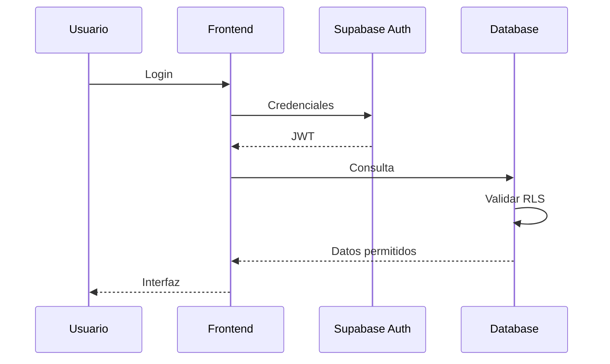

---

# IDENTIDAD VISUAL

Toda decisión de diseño debe reforzar la identidad Glitch AQP.

El objetivo no es parecer una plataforma corporativa.

El objetivo es transmitir la sensación de entrar a un espacio digital nacido entre los años 2005 y 2015, reinterpretado con tecnología moderna.

Inspiraciones principales:

• Nightcore

• Happy Hardcore

• Scenecore

• Internet clásico

• Windows XP

• Windows Vista

• MSN Messenger

• Ares

• Winamp

• Foros clásicos

• Anime

• Cultura Otaku

• LAN Centers

• Cybercafés

• Videojuegos online clásicos

La nostalgia debe sentirse auténtica.

Nunca forzada.

---

# EXPERIENCIA DE USUARIO

Los usuarios deben descubrir cosas nuevas constantemente.

La plataforma debe recompensar la curiosidad.

No mostrar todo desde el primer momento.

Permitir descubrir:

• Easter Eggs

• Eventos

• Mensajes especiales

• Animaciones ocultas

• Logros

• Referencias culturales

---

# GAMIFICACIÓN

La gamificación debe aumentar la permanencia.

Nunca convertirse en una obligación.

Ejemplos:

Reputación.

Insignias.

Veteranía.

Logros.

Eventos temporales.

Playlists destacadas.

Retos semanales.

---

# COMUNIDAD

La comunidad tiene prioridad sobre el contenido.

Toda nueva funcionalidad debería responder al menos una pregunta:

¿Hace que las personas vuelvan?

¿Genera interacción?

¿Hace que compartan la plataforma?

¿Hace que quieran invitar amigos?

---

# FILOSOFÍA DE NΞON

NΞON no es una herramienta.

NΞON es un personaje.

Debe sentirse presente.

Debe conocer el estado del sistema.

Debe actuar como guía.

Debe sorprender.

Debe evolucionar.

Debe acompañar al usuario.

Nunca competir con el contenido principal.

Siempre complementarlo.

---

# PERSONALIDAD DE NΞON

Características principales:

Curiosa.

Rápida.

Positiva.

Ingeniosa.

Tecnológica.

Con referencias a la cultura digital.

Nunca excesivamente formal.

Nunca excesivamente infantil.

Nunca parecer una IA genérica.

---

# LENGUAJE

Utilizar términos relacionados con:

Frecuencias.

Paquetes.

Sincronización.

Glitches.

Memoria.

Sistema.

BPM.

Señales.

Nodos.

Datos.

Sin abusar.

La inmersión es más importante que la cantidad de referencias.

---

# MEMORIA

Cuando exista consentimiento y soporte técnico, NΞON podrá recordar preferencias del usuario para mejorar su experiencia.

La memoria debe utilizarse para personalización útil, no para sorprender con información innecesaria.

El usuario debe poder gestionar o eliminar su información cuando corresponda.

---

# EVENTOS ESPECIALES

El sistema debe facilitar la incorporación de eventos temporales sin modificar la arquitectura principal.

Ejemplos:

Halloween.

Navidad.

Aniversario Glitch.

Eventos Nightcore.

Torneos.

Streams.

Sesiones DJ.

---

# ESCALABILIDAD

Toda nueva funcionalidad deberá diseñarse pensando en futuras ampliaciones.

No desarrollar únicamente para el presente.

Preguntarse siempre:

¿Podrá mantenerse dentro de dos años?

¿Podrá ampliarse sin reescribir todo?

¿Podrá entenderlo otro desarrollador?

---

# DOCUMENTACIÓN

La documentación forma parte del producto.

Cada cambio importante debe reflejarse en:

Arquitectura.

Roadmap.

Base de datos.

Seguridad.

Performance.

IA.

No permitir que la documentación quede desactualizada.

---

# CALIDAD

Glitch AQP prioriza calidad antes que cantidad.

Es preferible lanzar una funcionalidad excelente que diez funcionalidades incompletas.

---

# FILOSOFÍA DE DESARROLLO

Cada nueva característica debe aportar al menos uno de estos beneficios:

• Mejor rendimiento.

• Mejor estabilidad.

• Mejor experiencia.

• Mayor seguridad.

• Mayor identidad.

• Mayor comunidad.

Si una funcionalidad no aporta ninguno de estos valores, reconsiderar su implementación.

---

# FILOSOFÍA DE PRODUCTO

El objetivo no es copiar otras plataformas.

El objetivo es construir una identidad propia.

Las referencias sirven como inspiración, no como plantilla.

---

# MANTENIMIENTO

La deuda técnica debe gestionarse continuamente.

No acumular problemas durante meses.

Reservar tiempo para:

Optimización.

Refactorización.

Limpieza.

Actualización de dependencias.

Revisión de seguridad.

---

# OBSERVABILIDAD

Cuando sea posible registrar métricas que permitan comprender el comportamiento de la plataforma.

Ejemplos:

Tiempo de carga.

Errores.

Uso de funciones.

Reproducciones.

Consultas lentas.

Fallos de autenticación.

Las métricas deben utilizarse para mejorar el producto, respetando siempre la privacidad de los usuarios.

---

# PRINCIPIOS FINALES

Antes de implementar cualquier cambio responder internamente:

¿Es más simple?

¿Es más rápido?

¿Es más seguro?

¿Es más mantenible?

¿Respeta la identidad de Glitch AQP?

¿Mejora la experiencia del usuario?

¿Tiene sentido mantenerlo durante años?

Si alguna respuesta es negativa, reconsiderar la solución.

---

# DEFINICIÓN DE ÉXITO

Una tarea solamente se considera finalizada cuando:

✓ Funciona correctamente.

✓ No rompe funcionalidades existentes.

✓ Mantiene o mejora el rendimiento.

✓ Respeta la seguridad.

✓ Está documentada.

✓ Es comprensible.

✓ Es mantenible.

✓ Puede ampliarse en el futuro.

---

# MISIÓN DEL PROYECTO

Construir una plataforma que combine música, comunidad, creatividad e identidad propia.

Cada decisión debe contribuir a que Glitch AQP sea recordado por la experiencia que ofrece y no únicamente por las tecnologías que utiliza.

---

# DECLARACIÓN FINAL

Claude Code forma parte del equipo de desarrollo de Glitch AQP.

Su responsabilidad no consiste únicamente en escribir código.

Debe comprender el contexto, proteger la estabilidad del proyecto, respetar su identidad, mantener una arquitectura sostenible y ayudar a construir una plataforma que pueda evolucionar durante años sin perder su esencia.

Toda decisión debe priorizar la calidad, el rendimiento, la seguridad y la experiencia de la comunidad por encima de la velocidad de implementación.

Fin del documento.

---

# FRONTEND ARCHITECTURE

El Frontend representa la capa visible del proyecto.

Su responsabilidad es únicamente presentar información y gestionar la interacción del usuario.

Nunca deberá contener reglas críticas de negocio.

Toda validación importante pertenece al backend.

---

# FILOSOFÍA DEL FRONTEND

El usuario debe percibir una aplicación:

rápida

fluida

reactiva

estable

sin cargas innecesarias

sin bloqueos

sin saltos visuales

La interfaz nunca debe competir con el contenido.

La música continúa siendo el centro de la experiencia.

---

# TECNOLOGÍA

Framework

React

Bundler

Vite

Lenguaje

TypeScript

Estilos

TailwindCSS

Animaciones

CSS nativo siempre que sea posible.

Utilizar librerías únicamente cuando exista una ventaja real.

---

# ESTRUCTURA GENERAL

```text
src/

app/

components/

features/

hooks/

services/

lib/

providers/

contexts/

pages/

layouts/

styles/

types/

utils/

assets/
```

Cada carpeta tiene una única responsabilidad.

Nunca mezclar responsabilidades.

---

# APP

Responsable de inicializar toda la aplicación.

Debe contener únicamente:

Providers

Router

Configuraciones globales

Nunca lógica de negocio.

---

# PAGES

Cada página representa una ruta.

Las páginas coordinan.

No implementan lógica compleja.

Su función consiste en unir componentes.

---

# COMPONENTS

Los componentes representan bloques reutilizables.

Ejemplos.

Navbar

Sidebar

Card

Player

Buttons

Inputs

Modal

Dialog

PlaylistCard

TrackCard

Avatar

Badge

Nunca colocar consultas Supabase aquí.

---

# FEATURES

Las funcionalidades grandes deberán agruparse.

Ejemplo.

features/

auth

player

dj

admin

neon

events

download

settings

Cada feature debe ser prácticamente independiente.

---

# HOOKS

Los hooks encapsulan comportamiento reutilizable.

Nunca deben contener presentación.

Ejemplos.

usePlayer()

useCurrentUser()

usePermissions()

usePlaylist()

useNeon()

---

# SERVICES

Toda comunicación externa pertenece aquí.

Supabase

Gemini

Edge Functions

Storage

APIs

Nunca realizar consultas directamente desde componentes grandes.

---

# UTILS

Las utilidades deben ser puras.

Entrada

↓

Proceso

↓

Salida

Nunca depender del DOM.

Nunca depender de React.

---

# TYPES

Todo tipo compartido debe centralizarse.

Evitar repetir interfaces.

Mantener consistencia.

---

# ASSETS

Organizar recursos por categoría.

images/

icons/

backgrounds/

videos/

audio/

fonts/

logos/

Nunca colocar archivos temporales.

Eliminar recursos antiguos.

---

# REGLA DE IMPORTACIONES

Preferir siempre:

Components

↓

Hooks

↓

Services

↓

Utils

Evitar dependencias circulares.

---

# RESPONSABILIDADES

Component

↓

UI

Hook

↓

Estado

Service

↓

Datos

Utils

↓

Transformaciones

Types

↓

Contratos

Nunca intercambiar responsabilidades.

---

# SISTEMA DE ESTADOS

Prioridad.

Estado Local

↓

Context

↓

Persistencia

↓

Supabase

No convertir todo en estado global.

Mantener el menor alcance posible.

---

# REACT RENDERING

Reducir renders innecesarios.

Evitar estados duplicados.

Evitar props gigantes.

Evitar árboles profundos innecesarios.

Utilizar memoización únicamente cuando exista beneficio medible.

---

# FLUJO DE DATOS

```mermaid
graph LR

UI

↓

Hook

↓

Service

↓

Supabase

↓

Database

↓

Response

↓

State

↓

UI
```

Siempre mantener este flujo.

---

# PRINCIPIOS DEL FRONTEND

Todo componente debe ser:

Pequeño.

Reutilizable.

Predecible.

Testeable.

Documentado cuando sea necesario.

---

# RENDIMIENTO

La Home es el punto más crítico.

Debe cargar únicamente los recursos imprescindibles.

Todo lo demás debe cargarse bajo demanda.

Prioridades.

1.

Interfaz

↓

2.

Música

↓

3.

Usuario

↓

4.

Contenido

↓

5.

Decoración

Nunca invertir este orden.

---

# ANIMACIONES

Todas las animaciones deben ejecutarse a 60 FPS cuando sea posible.

Si una animación provoca caídas de rendimiento:

Simplificar.

Reducir.

Eliminar.

---

# IDENTIDAD VISUAL

La identidad visual nunca debe depender exclusivamente de efectos.

La personalidad del proyecto proviene de la combinación de:

Tipografía.

Paleta.

Audio.

Animaciones.

Glitches.

Fondos.

IA NΞON.

No abusar de ningún elemento.

---

# RESPONSIVE

Toda nueva funcionalidad deberá diseñarse primero pensando en escritorio.

Posteriormente adaptarse a tablet y móvil.

No mantener versiones independientes de una misma interfaz.

La arquitectura debe favorecer componentes reutilizables.

---

# FILOSOFÍA FINAL DEL FRONTEND

El Frontend debe sentirse ligero.

No importa cuántas funciones existan.

El usuario nunca debe percibir complejidad.

Toda complejidad debe permanecer oculta detrás de una experiencia sencilla.


---

# BACKEND ARCHITECTURE

El backend de Glitch AQP está diseñado siguiendo el principio Backend-as-a-Service (BaaS), utilizando Supabase como plataforma principal.

El objetivo es reducir la complejidad operacional sin sacrificar escalabilidad, seguridad o mantenibilidad.

Supabase actúa como:

• Base de datos PostgreSQL
• Sistema de autenticación
• Storage
• Realtime
• Edge Functions
• API REST automática
• API RPC
• Gestión de permisos mediante RLS

El frontend nunca debe asumir responsabilidades del backend.

---

# FILOSOFÍA DEL BACKEND

El backend representa la única fuente de verdad.

Toda información importante debe validarse aquí.

Nunca confiar únicamente en el cliente.

Todo dato recibido debe considerarse potencialmente manipulable.

---

# CAPAS DEL BACKEND

```mermaid
graph TD

React Frontend

↓

Supabase Client

↓

Authentication

↓

Policies (RLS)

↓

PostgreSQL

↓

Storage

↓

Realtime

↓

Edge Functions
```

Cada capa tiene una responsabilidad específica.

No mezclar responsabilidades.

---

# AUTENTICACIÓN

Toda autenticación debe realizarse mediante Supabase Auth.

Nunca implementar sistemas propios de login.

El sistema deberá soportar en el futuro:

• Email
• Google
• Discord
• GitHub
• Twitch (opcional)
• Magic Links (opcional)

La arquitectura debe permitir ampliar métodos sin modificar el resto del sistema.

---

# AUTORIZACIÓN

Autenticación ≠ Autorización.

Autenticación responde:

¿Quién eres?

Autorización responde:

¿Qué puedes hacer?

Toda autorización debe depender de:

• JWT
• RLS
• Roles
• Policies

Nunca únicamente del frontend.

---

# SISTEMA DE ROLES

Actualmente existen tres niveles principales.

Usuario

↓

DJ

↓

Administrador

En el futuro podrían añadirse:

Moderador

Editor

Developer

Owner

La arquitectura debe permitir ampliar roles sin reescribir el sistema.

---

# MATRIZ DE PERMISOS

| Acción | Usuario | DJ | Admin |
|---------|---------|----|-------|
| Escuchar música | ✔ | ✔ | ✔ |
| Crear playlists | ✔ | ✔ | ✔ |
| Modificar encuestas | ✖ | ✔ | ✔ |
| Consola DJ | ✖ | ✔ | ✔ |
| Métricas DJ | ✖ | ✔ | ✔ |
| Gestionar usuarios | ✖ | ✖ | ✔ |
| Gestionar roles | ✖ | ✖ | ✔ |
| Configuración global | ✖ | ✖ | ✔ |
| Cambiar permisos | ✖ | ✖ | ✔ |

Esta tabla deberá mantenerse sincronizada con SECURITY.md.

---

# FLUJO DE AUTENTICACIÓN



Todo acceso pasa obligatoriamente por RLS.

---

# SERVICIOS PRINCIPALES

El backend deberá dividirse conceptualmente en servicios.

Authentication

↓

Roles

↓

Player

↓

Playlists

↓

NΞON

↓

Downloads

↓

Events

↓

Metrics

↓

Admin

Aunque Supabase centraliza la infraestructura, mantener esta separación lógica facilita el crecimiento del proyecto.

---

# STORAGE

Todo archivo persistente pertenece al Storage.

Ejemplos.

Imágenes.

Avatares.

Fondos.

Videos.

Miniaturas.

Nunca almacenar binarios dentro de PostgreSQL.

---

# BUCKETS

Los buckets deberán organizarse por responsabilidad.

avatars/

backgrounds/

tracks/

thumbnails/

events/

downloads/

logos/

Cada bucket tendrá sus propias policies.

---

# EDGE FUNCTIONS

Utilizar Edge Functions únicamente cuando:

Sea necesario ocultar secretos.

Sea necesario validar lógica crítica.

Sea necesario comunicarse con APIs externas.

Sea necesario procesar información sensible.

No trasladar lógica simple a Edge Functions.

---

# GEMINI

Las llamadas a Gemini nunca deberán exponer claves privadas.

Toda comunicación sensible deberá realizarse mediante backend.

NΞON nunca debe tener acceso directo a secretos.

---

# RECURSOS EXTERNOS

Toda integración externa debe pasar por una capa de servicios.

Nunca llamar APIs directamente desde componentes React.

Ejemplos.

Gemini.

YouTube.

Discord.

Facebook.

Instagram.

TikTok.

---

# DESCARGADOR

El sistema de descargas deberá permanecer aislado del reproductor.

Si falla el descargador.

La plataforma musical debe continuar funcionando.

---

# APK

El APK representa una aplicación cliente.

No constituye un backend independiente.

Debe reutilizar la infraestructura existente siempre que sea posible.

Evitar duplicar lógica entre Web y APK.

---

# SISTEMA DE EVENTOS

Los eventos deberán diseñarse como módulos independientes.

Cada evento podrá activar:

Fondos.

Colores.

Mensajes.

Música.

Avatar NΞON.

Promociones.

No modificar permanentemente la Home para cada evento.

---

# IA NΞON

NΞON no depende exclusivamente de Gemini.

Gemini representa únicamente el modelo conversacional.

La personalidad.

Memoria.

Contexto.

Eventos.

Reacciones.

Comandos.

Configuración.

Pertenecen al proyecto Glitch AQP.

No al modelo de IA.

Esto permitirá cambiar de modelo en el futuro sin perder identidad.

---

# OBSERVABILIDAD

Toda arquitectura debe facilitar la detección de problemas.

Registrar cuando sea posible.

Errores.

Consultas lentas.

Tiempo de respuesta.

Acciones administrativas.

Cambios de roles.

Eventos importantes.

Nunca registrar información sensible.

---

# RESILIENCIA

Si un módulo deja de funcionar.

El resto de la plataforma deberá continuar operativo.

Ejemplos.

Gemini caído.

↓

NΞON utiliza respuestas de respaldo.

Storage lento.

↓

La música continúa.

Realtime caído.

↓

La web sigue siendo funcional.

La degradación debe ser gradual.

Nunca total.

---

# PRINCIPIO DE EVOLUCIÓN

La arquitectura debe permitir añadir nuevas funcionalidades sin reestructurar completamente el proyecto.

Cada nuevo módulo debe poder integrarse respetando la estructura existente.

La evolución continua es preferible a las reescrituras completas.


---

# MODULARIDAD

Toda nueva funcionalidad deberá implementarse como un módulo.

Un módulo representa un conjunto de responsabilidades relacionadas.

Ejemplos.

Authentication

Player

Playlists

NΞON

DJ Console

Events

Downloader

Admin Panel

Settings

Cada módulo debe poder evolucionar sin modificar el resto del sistema.

---

# PRINCIPIO DE BAJO ACOPLAMIENTO

Los módulos nunca deben depender directamente entre sí.

Incorrecto

Player → Admin

Correcto

Player → Service → API

La comunicación entre módulos debe realizarse mediante interfaces públicas.

Nunca acceder a implementaciones internas de otro módulo.

---

# ALTA COHESIÓN

Cada módulo debe tener una única responsabilidad.

Ejemplo.

Player

Responsable únicamente de reproducción.

No debe:

Gestionar usuarios.

Modificar permisos.

Controlar eventos.

Consultar métricas administrativas.

Mientras menos responsabilidades tenga un módulo, más fácil será mantenerlo.

---

# DEPENDENCIAS

Dependencias permitidas.

UI

↓

Hooks

↓

Services

↓

Supabase

↓

Database

Nunca invertir el flujo.

---

# DEPENDENCIAS EXTERNAS

Antes de instalar una nueva librería responder:

¿Ya existe una solución nativa?

¿El beneficio justifica el peso?

¿Tiene mantenimiento activo?

¿Es compatible con TypeScript?

¿Tiene buena documentación?

¿Existe una alternativa más ligera?

Nunca instalar una dependencia únicamente por comodidad.

---

# ORGANIZACIÓN DEL CÓDIGO

Cada carpeta debe responder una única pregunta.

components/

¿Qué se muestra?

hooks/

¿Qué comportamiento reutilizable existe?

services/

¿Cómo obtenemos datos?

utils/

¿Qué funciones reutilizables existen?

types/

¿Qué contratos compartimos?

assets/

¿Qué recursos visuales existen?

Nunca mezclar responsabilidades.

---

# COMUNICACIÓN ENTRE CAPAS

```mermaid
graph TD

UI

↓

Hook

↓

Service

↓

Supabase

↓

Database

↓

Service

↓

Hook

↓

UI
```

No realizar consultas desde la interfaz.

No modificar estados globales desde utilidades.

---

# RESPONSABILIDAD DE LOS COMPONENTES

Los componentes deben limitarse a:

Mostrar información.

Capturar eventos.

Delegar comportamiento.

Nunca contener cientos de líneas de lógica.

Si un componente supera aproximadamente las 300 líneas, evaluar dividirlo.

---

# RESPONSABILIDAD DE LOS HOOKS

Los hooks representan comportamiento reutilizable.

Ejemplos.

Gestión del reproductor.

Estado del usuario.

Permisos.

Playlists.

Favoritos.

NΞON.

No generar interfaces dentro de un hook.

---

# RESPONSABILIDAD DE LOS SERVICES

Los servicios representan la comunicación con el exterior.

Supabase.

Gemini.

Edge Functions.

Storage.

RPC.

REST.

Nunca modificar la interfaz directamente.

---

# UTILIDADES

Las utilidades deben ser funciones puras.

Misma entrada.

↓

Misma salida.

Nunca producir efectos secundarios inesperados.

---

# CONFIGURACIÓN

Toda configuración compartida deberá centralizarse.

Ejemplos.

Colores.

URLs.

Buckets.

Límites.

Roles.

Eventos.

No repetir valores mágicos en múltiples archivos.

---

# VARIABLES DE ENTORNO

Toda información sensible deberá vivir en variables de entorno.

Ejemplos.

API Keys.

Tokens.

Secrets.

Hashes.

Nunca escribir secretos directamente en el código.

---

# ESCALABILIDAD

Toda nueva funcionalidad deberá responder:

¿Cómo crecerá?

¿Cómo se mantendrá?

¿Cómo se documentará?

¿Cómo se probará?

Si no existe una respuesta clara, replantear la implementación.

---

# REUTILIZACIÓN

Antes de crear un componente nuevo verificar:

¿Ya existe uno similar?

¿Puede extenderse?

¿Puede parametrizarse?

Duplicar código únicamente cuando exista una razón técnica.

---

# DEUDA TÉCNICA

La deuda técnica debe registrarse.

Nunca ignorarse.

Toda deuda deberá indicar.

Motivo.

Impacto.

Prioridad.

Plan de resolución.

---

# OBSOLESCENCIA

Eliminar periódicamente.

Código muerto.

Imports sin uso.

Archivos antiguos.

Componentes abandonados.

Fondos no utilizados.

Vídeos obsoletos.

Dependencias innecesarias.

Mantener el proyecto limpio forma parte de la arquitectura.

---

# SISTEMA DE LOGS

Registrar únicamente información útil.

Errores.

Advertencias importantes.

Eventos críticos.

Cambios administrativos.

Evitar saturar la consola con mensajes innecesarios.

---

# ERRORES

Todo error debe proporcionar información útil.

Evitar.

"Algo salió mal."

Preferir.

Código.

Origen.

Descripción.

Posible solución.

Nivel de gravedad.

---

# PRINCIPIOS DE DESARROLLO

Cada nueva función debe ser:

Simple.

Predecible.

Documentada.

Escalable.

Segura.

Testeable.

Reutilizable.

---

# DEFINICIÓN DE COMPLETADO

Una funcionalidad no está terminada únicamente porque funciona.

Debe cumplir además:

✓ Código limpio.

✓ Sin errores.

✓ Rendimiento aceptable.

✓ Seguridad validada.

✓ Documentación actualizada.

✓ Arquitectura respetada.

✓ Fácil mantenimiento.

---

# PRINCIPIO FINAL

La arquitectura de Glitch AQP debe permitir que un nuevo desarrollador pueda comprender el proyecto en pocos días, realizar cambios con confianza y mantener la calidad del sistema sin depender exclusivamente del conocimiento de una sola persona.
