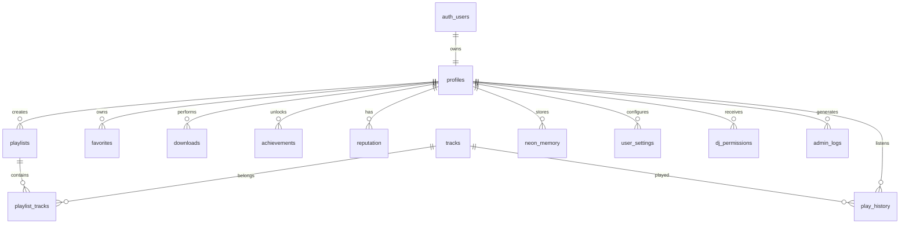

# DATABASE.md

Versión: PT v1.2 P1

Estado:
Arquitectura Oficial de Base de Datos

---

# PROPÓSITO

Este documento define la arquitectura de datos oficial de Glitch AQP.

No solamente describe tablas.

Describe cómo deben diseñarse.

Cómo evolucionan.

Cómo se relacionan.

Cómo protegerlas.

Toda modificación importante deberá respetar esta documentación.

---

# FILOSOFÍA

La base de datos representa la única fuente oficial de verdad.

No duplicar información crítica.

No confiar en estados del frontend.

No almacenar datos redundantes salvo que exista un beneficio claro de rendimiento.

---

# PRINCIPIOS

Toda tabla debe cumplir.

Una responsabilidad.

↓

Un propósito.

↓

Un propietario lógico.

↓

Relaciones claras.

↓

Índices adecuados.

↓

Policies documentadas.

Nunca crear tablas "temporales" dentro de producción.

---

# TECNOLOGÍA

Motor

PostgreSQL

Proveedor

Supabase

Autenticación

Supabase Auth

Realtime

Supabase Realtime

Storage

Supabase Storage

Seguridad

Row Level Security (RLS)

---

# PRINCIPIOS DE DISEÑO

Normalizar cuando sea posible.

Desnormalizar únicamente cuando exista una mejora demostrable.

Evitar duplicar columnas.

Evitar almacenar datos calculables.

Evitar campos ambiguos.

---

# CONVENCIONES DE NOMBRES

Tablas

snake_case

Ejemplo.

user_profiles

playlists

tracks

events

dj_metrics

---

Columnas

snake_case

Ejemplos.

created_at

updated_at

display_name

avatar_url

play_count

last_login

Nunca mezclar camelCase con snake_case.

---

Primary Keys

id

UUID

Siempre que sea posible.

---

Foreign Keys

tabla_id

Ejemplos.

user_id

playlist_id

track_id

event_id

---

Timestamps

Toda tabla deberá incluir.

created_at

updated_at

Cuando tenga sentido.

deleted_at

Para Soft Delete.

---

# TIPOS DE DATOS

UUID

Identificadores.

TEXT

Información variable.

VARCHAR

Solo cuando exista límite conocido.

BOOLEAN

Estados.

INTEGER

Contadores.

BIGINT

Grandes cantidades.

JSONB

Configuraciones dinámicas.

TIMESTAMPTZ

Fechas.

Nunca utilizar TEXT para almacenar fechas.

---

# ESTRUCTURA GENERAL

---

# TABLAS PRINCIPALES

La arquitectura gira alrededor de estas entidades.

profiles

tracks

artists

albums

genres

playlists

playlist_tracks

favorites

history

events

polls

downloads

user_settings

achievements

reputation

roles

permissions

admin_logs

neon_memory

system_metrics

---

# RESPONSABILIDADES

profiles

Información pública del usuario.

roles

Permisos.

tracks

Canciones.

playlists

Colecciones.

favorites

Favoritos.

events

Eventos.

downloads

Registro de descargas.

admin_logs

Auditoría.

neon_memory

Contexto personalizado.

Nunca mezclar responsabilidades.

---

# MODELO DE RELACIONES

Un usuario.

↓

Puede crear muchas playlists.

↓

Puede tener muchos favoritos.

↓

Puede escuchar miles de canciones.

↓

Puede desbloquear logros.

↓

Puede tener memoria personalizada.

---

# IDENTIFICADORES

Todas las entidades importantes utilizarán UUID.

Nunca IDs autoincrementales para datos públicos.

Esto dificulta enumeraciones maliciosas.

---

# ELIMINACIÓN

Preferir Soft Delete cuando exista riesgo de pérdida de información.

Ejemplo.

deleted_at

Nunca eliminar información crítica sin posibilidad de auditoría.

---

# AUDITORÍA

Toda acción administrativa importante deberá registrarse.

Ejemplos.

Cambio de rol.

Cambio de permisos.

Eliminación.

Restauración.

Configuraciones.

Nunca perder trazabilidad.

---

# CONSISTENCIA

Toda modificación importante deberá ejecutarse mediante transacciones cuando intervengan múltiples tablas.

Objetivo.

Evitar estados inconsistentes.

---

# FILOSOFÍA FINAL

Una buena base de datos no solamente guarda información.

Define las reglas sobre las que funciona toda la plataforma.

Por ello, cualquier modificación estructural debe analizarse cuidadosamente antes de implementarse.

---

# TABLA: profiles

## Propósito

Representa la identidad pública de cada usuario.

No sustituye a auth.users.

Debe almacenar únicamente información propia de la aplicación.

---

## Relaciones

auth.users

↓

profiles

↓

playlists

favorites

history

downloads

achievements

settings

roles

---

## Campos recomendados

id

user_id

username

display_name

avatar_url

banner_url

biography

country

language

theme

created_at

updated_at

deleted_at

---

## Índices

user_id

username

display_name

---

## RLS

El usuario únicamente podrá modificar su propio perfil.

Los administradores podrán realizar mantenimiento.

Nunca permitir UPDATE global.

---

## Responsabilidades

Perfil.

Avatar.

Preferencias.

Configuración pública.

Nunca almacenar permisos aquí.

---

# TABLA: roles

## Propósito

Determinar el nivel de acceso del usuario.

No almacenar permisos directamente en profiles.

---

## Roles actuales

User

DJ

Admin

---

## Futuras ampliaciones

Moderator

Developer

Owner

Support

---

## Campos

id

user_id

role

assigned_by

assigned_at

updated_at

---

## Restricciones

Un usuario únicamente puede tener un rol principal activo.

Los cambios deberán registrarse en admin_logs.

---

# TABLA: permissions

## Propósito

Permisos específicos adicionales.

No sustituye al rol principal.

Permite otorgar capacidades puntuales.

---

## Ejemplos

manage_events

manage_polls

view_metrics

manage_music

beta_access

---

## Beneficio

Evita crear decenas de roles diferentes.

---

# TABLA: tracks

## Propósito

Representa cada canción registrada.

---

## Campos

id

title

artist_id

album_id

genre_id

duration

cover_url

audio_url

play_count

likes

status

created_at

updated_at

---

## Índices

title

artist_id

genre_id

play_count

---

## Consultas frecuentes

Buscar.

Filtrar.

Ordenar.

Reproducir.

Nunca realizar SELECT *.

---

# TABLA: artists

## Propósito

Evitar repetir nombres de artistas.

Permitir futuras páginas dedicadas.

---

## Campos

id

name

image

description

country

verified

created_at

---

# TABLA: albums

## Propósito

Agrupar canciones.

---

## Campos

id

title

artist_id

cover

release_date

created_at

---

# TABLA: genres

## Propósito

Clasificar música.

---

## Géneros previstos

Nightcore

Happy Hardcore

Scenecore

Eurodance

J-Core

Hardstyle

Hands Up

Hyperpop

Electronic

Otros

---

# TABLA: playlists

## Propósito

Colecciones creadas por usuarios.

---

## Campos

id

owner_id

title

description

cover

visibility

likes

play_count

created_at

updated_at

---

## Visibilidad

Public

Private

Unlisted

---

# TABLA: playlist_tracks

## Propósito

Tabla puente.

Muchos a muchos.

---

Playlist

↓

Track

---

Campos

playlist_id

track_id

position

added_at

---

# TABLA: favorites

## Propósito

Registrar favoritos del usuario.

---

Campos

user_id

track_id

created_at

---

Nunca almacenar información duplicada.

---

# TABLA: history

## Propósito

Historial de reproducción.

---

Campos

user_id

track_id

played_at

device

duration

---

## Beneficios

Estadísticas.

Recomendaciones.

NΞON.

Eventos.

---

# TABLA: downloads

## Propósito

Registrar descargas realizadas.

No almacenar el archivo.

Únicamente el historial.

---

Campos

user_id

platform

url

status

created_at

---

## Plataformas previstas

YouTube

TikTok

Instagram

Facebook

SoundCloud

Otras futuras.

---

# TABLA: achievements

## Propósito

Sistema de logros.

---

Ejemplos

100 canciones.

1000 reproducciones.

30 días.

Primer playlist.

Primer evento.

Veterano.

---

# TABLA: reputation

## Propósito

Sistema de progreso.

---

Escala

Visitor

↓

Listener

↓

Runner

↓

Glitch

↓

Accelerator

↓

Hyper

↓

Core

↓

Night Driver

↓

Legend

---

La reputación deberá depender de actividad real.

Nunca únicamente del tiempo.

---

# TABLA: user_settings

## Propósito

Preferencias personales.

---

Ejemplos

Idioma.

Tema.

Volumen.

Calidad.

Animaciones.

Notificaciones.

Inicio automático.

---

# TABLA: neon_memory

## Propósito

Memoria personalizada de NΞON.

---

Ejemplos

Artista favorito.

Playlist favorita.

Horario habitual.

Color favorito.

Última conversación.

Preferencias.

---

Nunca almacenar información sensible.

---

# TABLA: admin_logs

## Propósito

Auditoría completa.

---

Campos

admin_id

action

target

description

created_at

ip

metadata

---

Nunca eliminar registros.

---

# TABLA: system_metrics

## Propósito

Métricas internas.

---

Ejemplos

Usuarios activos.

Canciones reproducidas.

Tiempo medio.

Errores.

Consultas.

Uso IA.

---

No utilizar para analítica personal sin consentimiento.

---

# PRINCIPIO DE MODELADO

Cada tabla representa una única entidad del negocio.

Si una tabla necesita almacenar responsabilidades completamente distintas, probablemente deba dividirse.

Mantener un modelo simple facilita la evolución del sistema.

---

# ÍNDICES

Los índices representan una de las herramientas más importantes para mantener el rendimiento.

No crear índices por costumbre.

Cada índice debe justificar su existencia mediante consultas frecuentes.

---

# CAMPOS CANDIDATOS A ÍNDICES

Usuarios

user_id

username

email (cuando corresponda)

display_name

---

Canciones

title

artist_id

genre_id

album_id

play_count

status

---

Playlists

owner_id

visibility

created_at

likes

---

Eventos

event_date

status

type

---

Descargas

user_id

platform

created_at

status

---

Logs

admin_id

action

created_at

---

# ÍNDICES COMPUESTOS

Cuando las consultas utilicen varias columnas simultáneamente considerar índices compuestos.

Ejemplos.

(user_id, created_at)

(owner_id, visibility)

(track_id, play_count)

(event_date, status)

Nunca crear índices duplicados.

---

# EXPLAIN ANALYZE

Antes de optimizar una consulta importante utilizar:

EXPLAIN ANALYZE

Documentar consultas lentas.

Optimizar únicamente cuando existan evidencias.

Nunca optimizar por intuición.

---

# CONSULTAS

Prioridades.

Solicitar únicamente columnas necesarias.

Evitar SELECT *.

Limitar resultados.

Aplicar filtros.

Utilizar paginación.

Reducir tráfico.

---

# PAGINACIÓN

Nunca cargar listas completas.

Utilizar:

LIMIT

OFFSET

Cursor Pagination cuando sea necesario.

Especialmente para.

Canciones.

Playlists.

Usuarios.

Historial.

Logs.

---

# TRANSACCIONES

Utilizar transacciones cuando varias operaciones dependan entre sí.

Ejemplos.

Cambio de rol.

↓

Actualizar rol

↓

Registrar auditoría

↓

Actualizar permisos

↓

Confirmar

Si una operación falla.

Toda la transacción debe revertirse.

---

# INTEGRIDAD REFERENCIAL

Toda relación importante deberá utilizar Foreign Keys.

Evitar referencias únicamente mediante texto.

Siempre que sea posible.

La base de datos debe proteger la integridad automáticamente.

---

# CASCADE

Utilizar ON DELETE CASCADE únicamente cuando tenga sentido.

Ejemplos adecuados.

playlist_tracks

favorites

history

Evitar CASCADE sobre información crítica.

---

# SOFT DELETE

Cuando exista riesgo de pérdida de información.

Utilizar.

deleted_at

Nunca eliminar inmediatamente.

Especialmente.

Usuarios.

Eventos.

Playlists.

Registros administrativos.

---

# HARD DELETE

Únicamente cuando.

La información sea temporal.

No tenga valor histórico.

No afecte auditorías.

---

# TRIGGERS

Los triggers deben mantenerse simples.

Ejemplos.

Actualizar updated_at.

Registrar auditoría.

Incrementar contadores.

Sincronizar estadísticas.

Nunca colocar lógica compleja.

---

# FUNCIONES RPC

Utilizar funciones SQL cuando:

Reducen múltiples consultas.

Protegen lógica sensible.

Mejoran rendimiento.

Simplifican el frontend.

Documentar todas las funciones.

---

# VISTAS

Utilizar Views para consultas repetidas.

Ejemplos.

Top canciones.

Eventos activos.

Usuarios destacados.

Métricas.

Nunca duplicar lógica SQL en varios lugares.

---

# MATERIALIZED VIEWS

Considerar únicamente para información pesada.

Rankings.

Estadísticas.

Reportes.

Actualizar periódicamente.

---

# JSONB

Utilizar únicamente cuando la estructura sea dinámica.

Ejemplos.

Configuraciones.

Preferencias.

Metadata.

Nunca almacenar estructuras completas que deberían ser tablas.

---

# NORMALIZACIÓN

Priorizar tercera forma normal.

Desnormalizar únicamente cuando exista un beneficio comprobable.

Toda desnormalización debe documentarse.

---

# BACKUPS

La base de datos deberá contar con estrategia de respaldo.

Objetivos.

Recuperación.

Migraciones seguras.

Protección ante errores humanos.

---

# RECUPERACIÓN

Toda migración importante deberá poder revertirse.

Nunca ejecutar SQL irreversible directamente sobre producción.

Mantener scripts de rollback cuando sea posible.

---

# VERSIONADO

Toda modificación estructural debe quedar registrada.

Nunca modificar producción manualmente sin documentación.

Toda migración debe indicar.

Fecha.

Autor.

Objetivo.

Impacto.

Rollback.

---

# AUDITORÍA

Toda acción administrativa importante deberá generar un registro.

Ejemplos.

Cambio de rol.

Cambio de permisos.

Eliminación.

Restauración.

Configuraciones.

No registrar contraseñas.

No registrar secretos.

---

# SEGURIDAD

Toda consulta debe asumir que el cliente puede ser manipulado.

Nunca confiar únicamente en el frontend.

La validación definitiva pertenece a PostgreSQL y RLS.

---

# CHECKLIST ANTES DE EJECUTAR SQL

□ Existe backup.

□ Existe rollback.

□ Se probó en desarrollo.

□ Se documentó.

□ Se conocen las tablas afectadas.

□ Se conocen las policies afectadas.

□ Se conocen los índices afectados.

□ Se estimó impacto.

□ No rompe compatibilidad.

---

# CHECKLIST DESPUÉS DE EJECUTAR SQL

□ Migración exitosa.

□ Sin errores.

□ RLS funcionando.

□ Índices correctos.

□ Relaciones válidas.

□ Consultas verificadas.

□ Frontend funcionando.

□ Documentación actualizada.

---

# FILOSOFÍA DE DATOS

La base de datos debe ser estable.

Cambiar el esquema constantemente genera deuda técnica.

Es preferible dedicar tiempo al diseño antes de crear nuevas tablas.

Una estructura bien diseñada puede acompañar al proyecto durante muchos años sin necesidad de grandes reestructuraciones.

