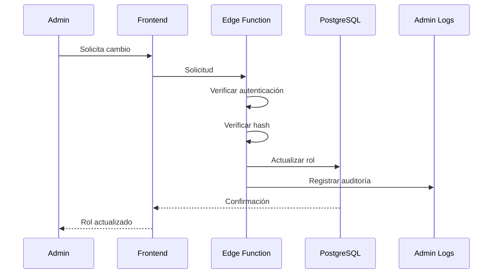

# SECURITY.md

Versión: PT v1.2 P1

Estado:
Política Oficial de Seguridad

---

# PROPÓSITO

La seguridad forma parte de la arquitectura.

No representa una característica adicional.

Todo cambio deberá respetar este documento.

Cuando exista un conflicto entre comodidad y seguridad, deberá priorizarse la seguridad, procurando mantener una buena experiencia de usuario.

---

# FILOSOFÍA

Todo dato proveniente del cliente debe considerarse potencialmente manipulado.

El frontend existe para mejorar la experiencia.

No representa una fuente confiable.

La validación definitiva pertenece al backend.

---

# PRINCIPIOS

Security by Design

↓

Least Privilege

↓

Defense in Depth

↓

Fail Secure

↓

Auditability

↓

Maintainability

Nunca romper este orden.

---

# CAPAS DE SEGURIDAD

```mermaid
graph TD

Usuario

↓

Frontend

↓

Validación Cliente

↓

HTTPS

↓

Supabase Auth

↓

JWT

↓

RLS

↓

PostgreSQL

↓

Storage

↓

Logs

↓

Backups
```

Cada capa protege a la siguiente.

Nunca depender únicamente de una sola capa.

---

# OBJETIVOS

Garantizar:

Confidencialidad.

Integridad.

Disponibilidad.

Autenticidad.

Trazabilidad.

---

# AMENAZAS PRINCIPALES

Manipulación del frontend.

Escalada de privilegios.

Robo de tokens.

Fugas de Storage.

Consultas no autorizadas.

Inyección SQL.

XSS.

CSRF cuando corresponda.

Spam.

Bots.

Abuso de APIs.

Fuerza bruta.

---

# AUTENTICACIÓN

Toda autenticación deberá utilizar Supabase Auth.

No implementar sistemas propios.

No almacenar contraseñas.

No crear tablas personalizadas para credenciales.

---

# JWT

El JWT representa la identidad del usuario.

Nunca modificarlo manualmente.

Nunca confiar únicamente en datos visibles del token.

Las Policies deberán validar siempre el acceso.

---

# SESIONES

Las sesiones deberán mantenerse únicamente el tiempo necesario.

Evitar sesiones permanentes innecesarias.

Cerrar correctamente la sesión al salir.

---

# RECUPERACIÓN DE CUENTA

Toda recuperación deberá delegarse a Supabase.

Nunca implementar mecanismos personalizados inseguros.

---

# VARIABLES DE ENTORNO

Nunca subir al repositorio:

Service Role Key.

Gemini API Key.

Secrets.

Hashes administrativos.

Tokens privados.

URLs internas.

Credenciales de producción.

---

# GITHUB

Agregar al .gitignore todos los archivos sensibles.

Ejemplos.

.env

.env.local

.env.production

service-role.json

Nunca hacer commit de secretos.

---

# VALIDACIÓN

Toda entrada del usuario deberá validarse.

Ejemplos.

Nombre.

Correo.

Descripción.

Playlists.

Encuestas.

Comentarios.

Mensajes.

URLs.

Nunca confiar únicamente en validaciones HTML.

---

# SANITIZACIÓN

Escapar contenido mostrado al usuario cuando corresponda.

Evitar ejecutar HTML arbitrario.

Evitar XSS.

---

# SUBIDAS DE ARCHIVOS

Antes de aceptar un archivo verificar.

Tipo.

Tamaño.

Formato.

Nombre.

Extensión.

Nunca confiar únicamente en la extensión del archivo.

---

# STORAGE

Cada bucket deberá poseer sus propias Policies.

No utilizar buckets públicos para información privada.

Separar contenido público y privado.

---

# DESCARGAS

El sistema de descargas nunca deberá ejecutar código recibido del usuario.

Validar plataformas permitidas.

Registrar actividad cuando corresponda.

Mantener aislamiento respecto al resto del sistema.

---

# GEMINI

Las llamadas al modelo nunca deben exponer claves privadas.

Toda clave deberá permanecer exclusivamente en backend o Edge Functions.

NΞON nunca debe revelar información del sistema ni secretos de configuración.

---

# RATE LIMITING

Aplicar límites cuando sea necesario sobre:

Inicio de sesión.

Registro.

Cambios de rol.

Consultas IA.

Descargas.

Operaciones administrativas.

---

# AUDITORÍA

Registrar como mínimo.

Usuario.

Fecha.

Hora.

Acción.

Resultado.

Origen cuando sea posible.

Nunca registrar información sensible.

---

# PRINCIPIO FINAL

Toda funcionalidad nueva deberá incluir una revisión de seguridad antes de considerarse terminada.

La seguridad no se añade al final del desarrollo.

Se diseña desde el inicio.


---

# SISTEMA DE ROLES

La plataforma implementa un modelo RBAC (Role Based Access Control).

Los permisos deberán depender del rol asignado y, cuando corresponda, de permisos específicos adicionales.

El frontend únicamente representa la interfaz.

La autorización definitiva pertenece a Supabase y PostgreSQL.

---

# ROLES OFICIALES

Actualmente existen tres roles principales.

USER

↓

DJ

↓

ADMIN

Todos los usuarios nuevos comienzan como USER.

Nunca asignar privilegios elevados automáticamente.

---

# USER

Representa el rol por defecto.

Permisos.

Escuchar música.

Crear playlists.

Administrar su perfil.

Guardar favoritos.

Participar en encuestas.

Interactuar con NΞON.

Modificar únicamente información propia.

No puede modificar datos de otros usuarios.

---

# DJ

Representa un creador de contenido.

Debe tener acceso únicamente a funciones relacionadas con su actividad.

Permisos permitidos.

Consola DJ.

Métricas DJ.

Gestión de encuestas.

Publicación de contenido autorizado.

Visualización de estadísticas propias.

Nunca podrá:

Gestionar usuarios.

Modificar roles.

Acceder a configuración global.

Cambiar Policies.

Acceder al Service Role.

Modificar administradores.

---

# ADMIN

Representa el máximo nivel administrativo.

Debe tener acceso únicamente mediante autenticación válida.

Toda acción importante deberá registrarse.

Permisos.

Gestionar usuarios.

Cambiar roles.

Gestionar eventos.

Gestionar contenido.

Configuración.

Auditoría.

Moderación.

Panel administrativo.

Nunca deberá depender únicamente de controles visuales del frontend.

---

# OWNER

Actualmente no existe.

La arquitectura deberá permitir añadirlo en el futuro.

Owner representa el propietario absoluto del proyecto.

No debe implementarse hasta que exista una necesidad real.

---

# MATRIZ DE ACCESO

| Función | User | DJ | Admin |
|---------|:----:|:--:|:-----:|
| Reproducir música | ✓ | ✓ | ✓ |
| Crear playlists | ✓ | ✓ | ✓ |
| Editar perfil | ✓ | ✓ | ✓ |
| Acceder a consola DJ | ✗ | ✓ | ✓ |
| Gestionar encuestas | ✗ | ✓ | ✓ |
| Ver métricas DJ | ✗ | ✓ | ✓ |
| Gestionar eventos | ✗ | ✗ | ✓ |
| Gestionar usuarios | ✗ | ✗ | ✓ |
| Cambiar roles | ✗ | ✗ | ✓ |
| Configuración global | ✗ | ✗ | ✓ |

---

# CAMBIO DE ROLES

Todo cambio de rol deberá seguir este flujo.



Nunca actualizar roles directamente desde el frontend.

---

# HASH ADMINISTRATIVO

Las promociones a ADMIN requieren una credencial adicional.

El objetivo es evitar promociones accidentales o maliciosas.

El hash administrativo:

Nunca viaja al navegador en texto plano.

Nunca se almacena en LocalStorage.

Nunca se almacena en SessionStorage.

Nunca aparece dentro del código JavaScript.

Debe validarse únicamente en backend o Edge Functions.

---

# PROMOCIÓN A DJ

La promoción a DJ no requiere el hash administrativo.

Pero sí requiere.

Administrador autenticado.

Permisos válidos.

Registro de auditoría.

Validación del backend.

---

# REBAJAR PRIVILEGIOS

Reducir privilegios sigue exactamente las mismas reglas.

Toda modificación debe quedar registrada.

Nunca eliminar auditorías.

---

# PRINCIPIO DE MENOR PRIVILEGIO

Todo usuario deberá poseer únicamente los permisos estrictamente necesarios.

Nunca otorgar privilegios "por si acaso".

---

# VALIDACIÓN DE PERMISOS

Los permisos deberán validarse en tres niveles.

Frontend

↓

Edge Function

↓

RLS

Si cualquiera de estas capas falla.

Las demás continúan protegiendo el sistema.

---

# RLS

Toda tabla sensible deberá utilizar Row Level Security.

Nunca desactivar RLS para simplificar el desarrollo.

Si una Policy resulta compleja.

Rediseñar la solución.

Nunca eliminar seguridad.

---

# POLÍTICAS

Cada Policy deberá responder únicamente una pregunta.

¿Quién puede?

Leer.

Insertar.

Actualizar.

Eliminar.

Evitar Policies demasiado complejas.

---

# STORAGE

Cada bucket tendrá Policies independientes.

Ejemplos.

avatars

public

backgrounds

public

tracks

protegido

downloads

privado

admin-assets

solo administradores

---

# EDGE FUNCTIONS

Toda operación crítica deberá pasar por Edge Functions.

Ejemplos.

Cambio de rol.

Validación del hash.

Consultas administrativas.

Acciones sobre NΞON que requieran secretos.

Nunca utilizar Edge Functions para lógica sencilla que pueda resolverse mediante RLS.

---

# LOGS

Toda acción administrativa importante deberá registrarse.

Ejemplos.

Inicio de sesión administrativo.

Cambio de rol.

Configuración.

Eliminación.

Restauración.

Actualización crítica.

Los registros deberán ser inmutables.

---

# PRINCIPIO FINAL

Los permisos representan la columna vertebral de la seguridad.

Si existe una duda sobre quién debería poder realizar una acción.

La respuesta correcta por defecto es:

Negar el acceso hasta que exista una regla explícita que lo permita.


---

# THREAT MODEL

El objetivo de esta sección es identificar las amenazas más probables para Glitch AQP y definir las medidas de mitigación correspondientes.

No pretende eliminar todos los riesgos.

Su objetivo es reducir el impacto y aumentar la capacidad de respuesta.

---

# ACTIVOS CRÍTICOS

Los siguientes recursos se consideran críticos.

Base de datos PostgreSQL.

Supabase Auth.

Storage.

Roles.

Permisos.

Edge Functions.

Gemini API Key.

Hashes administrativos.

Información de usuarios.

Configuración de eventos.

Historial de auditoría.

Repositorio del proyecto.

---

# SUPERFICIES DE ATAQUE

Frontend.

APIs.

Edge Functions.

Storage.

Autenticación.

Realtime.

Repositorio Git.

Variables de entorno.

Descargador.

APK.

NΞON.

---

# AMENAZA

Manipulación del Frontend.

Descripción.

El atacante modifica el JavaScript mediante DevTools.

Impacto.

Puede ocultar botones.

Puede intentar enviar solicitudes no previstas.

Mitigación.

Nunca confiar en el frontend.

Toda autorización debe validarse mediante RLS o Edge Functions.

---

# AMENAZA

Escalada de privilegios.

Descripción.

Intentar convertirse en DJ o Admin modificando solicitudes.

Mitigación.

Verificación del rol actual.

Validación mediante backend.

Hash administrativo.

Registro obligatorio en admin_logs.

---

# AMENAZA

Robo de JWT.

Descripción.

Obtención del token mediante malware, XSS o un dispositivo comprometido.

Mitigación.

Sesiones limitadas.

Revocación cuando sea posible.

HTTPS obligatorio.

Evitar exponer tokens innecesariamente.

No almacenar secretos junto al token.

---

# AMENAZA

Fuga de API Keys.

Descripción.

Exposición accidental de claves privadas.

Mitigación.

Variables de entorno.

Edge Functions.

Rotación inmediata de claves comprometidas.

Nunca publicar secretos en Git.

---

# AMENAZA

Acceso indebido al Storage.

Descripción.

Intentar descargar archivos privados.

Mitigación.

Buckets separados.

Policies específicas.

URLs firmadas cuando corresponda.

---

# AMENAZA

Abuso del sistema de descargas.

Descripción.

Uso masivo o automatizado del descargador.

Mitigación.

Rate limiting.

Registros.

Límites por usuario.

Límites por IP cuando sea posible.

---

# AMENAZA

Spam.

Descripción.

Creación masiva de contenido.

Mitigación.

Rate limiting.

Moderación.

Validación.

Sistemas CAPTCHA cuando resulte necesario.

---

# AMENAZA

Ataques automatizados.

Descripción.

Bots realizando solicitudes repetitivas.

Mitigación.

Límites de frecuencia.

Análisis de comportamiento.

Bloqueo temporal.

---

# AMENAZA

Consultas excesivas.

Descripción.

Solicitudes que generan alta carga.

Mitigación.

Paginación.

Índices.

Cache.

Optimización SQL.

---

# AMENAZA

Divulgación de información.

Descripción.

Mostrar datos internos por errores.

Mitigación.

Mensajes de error genéricos para el usuario.

Detalles únicamente en logs.

---

# RESPUESTA ANTE INCIDENTES

Toda incidencia deberá seguir un procedimiento documentado.

Identificar.

↓

Contener.

↓

Analizar.

↓

Corregir.

↓

Documentar.

↓

Prevenir.

Nunca resolver un incidente sin registrar lo ocurrido.

---

# FILTRACIÓN DE SECRETOS

Si una clave privada se filtra.

Pasos.

Revocar.

Generar una nueva.

Actualizar producción.

Actualizar desarrollo.

Verificar accesos.

Documentar el incidente.

Nunca reutilizar una clave comprometida.

---

# CUENTA ADMINISTRATIVA COMPROMETIDA

Procedimiento.

Revocar sesiones.

Cambiar credenciales.

Revisar auditorías.

Verificar cambios recientes.

Restaurar configuraciones si corresponde.

---

# BACKUPS

Antes de cambios importantes.

Verificar respaldo.

Después del cambio.

Verificar integridad.

Nunca asumir que el backup funciona sin probar la restauración.

---

# DESPLIEGUE SEGURO

Checklist.

□ Variables correctas.

□ Secrets cargados.

□ Sin claves en Git.

□ RLS activas.

□ Buckets protegidos.

□ Edge Functions actualizadas.

□ Logs funcionando.

□ Documentación sincronizada.

---

# REVISIÓN DE CÓDIGO

Toda Pull Request que modifique autenticación, permisos o seguridad deberá responder:

¿Qué riesgo introduce?

¿Qué riesgo elimina?

¿Cómo se probó?

¿Rompe compatibilidad?

¿Requiere cambios en RLS?

¿Requiere migraciones?

---

# PRINCIPIO DE RECUPERACIÓN

Ningún error de configuración debería impedir recuperar el control del sistema.

Siempre debe existir un procedimiento documentado para restaurar el acceso administrativo sin comprometer la seguridad.

---

# FILOSOFÍA FINAL

La seguridad no consiste en impedir todos los ataques.

Consiste en reducir su probabilidad, limitar su impacto y facilitar una recuperación rápida y controlada.

