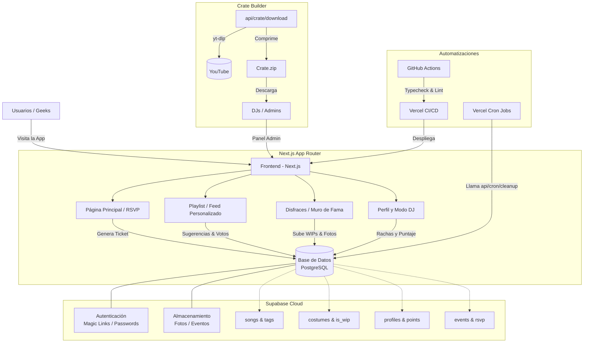

# Esquema de Funcionamiento - Nightcore AQP

## Flujos Principales Implementados

1. **El Hype (Pre-Evento):** Los usuarios interactúan con `Disfraces` subiendo fotos de sus WIPs (Work in Progress). Votan en temáticas para los próximos eventos y reservan sus tickets RSVP (lo que incrementa la urgencia debido al contador de aforo restante).
2. **El Feed Personalizado:** A través de la página `/playlist`, las sugerencias de canciones se agrupan por `tags`. El usuario puede filtrar su lista y el frontend calcula dinámicamente qué mostrar.
3. **El Evento en Vivo (Modo DJ):** El DJ accede a `/admin` y genera un "Crate" en ZIP. En el panel, proyecta el reproductor visual con fondo de video y pone el `GlobalPlayer` para reproducir las canciones más votadas en tiempo real.
4. **Post-Evento y Retención:** El sistema otorga puntos y rachas (`streaks`) a los usuarios que asistieron (probado mediante fotos Miku-Modal). El CronJob semanal limpia la base de datos de archivos de caché pesados para evitar costos de hosting excesivos en Supabase.
